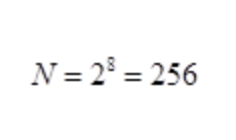

# 1.1 Язык Си. Первые шаги.

В 1936 году английский матемтик Алан Тьюринг предложил концепцию абстрактной универсальной вычислительной машины, которая выполняла различные задачи в зависимости от загруженных в нее данных. Вскоре эта идея получила название **универсальной машины Тьюринга**. 
Позднее, венгерско-американский математик Джон Фон Нейман развил эту идею, предложив хранить команды и данные в единой, однородной памяти компьютера. До этого команды было необходимо записывать в отдельный тип памяти а данные в независимо в другой тип. Это приводило к заметным неудобствам! Поэтому идея фон Неймана по **объединению** команд и данных в единой памяти оказалась прорывной для того времени. Она стала настолько удачной, что сейчас практических вся вычислительная техника построена по архитектуре предложенной Джоном фон Нейманом.

- Первое поколение компьютеров (с 1944 года) построенных на электронных лампах, использовали принцип однородности памяти для данных и команд. Уже тогда была принята на вооружение архитектура фон Неймана. И вычислительная техника созданная по такому принципу имела название **машина фон Неймана**.  
- Второе поколение компьютеров (с середины 1950-х) было выполненно на транзисторах. Схемотехнически это были те же лампы, однако реализованные на уровне полупроводников. В результате данной инновации техника стала меньших объемов, соответственно снизилось количество потребление электроэнергии, повысилась эффективность вычислительной мощи. Внутреннее устройство компьютеров этого и всех последующих поколений уже базировалось на **архитектуре фон Неймана**.
- Третье поколение компьютеров (с 1960-х годов) были разработанны на базе **интегральных схем** (микросхем), которые объединяли внутри себя схемы из большого числа транзисторов. Это привело к еще большему уменьшению вычислительной техники и быстродействию.
- Четвертое поколение компьютеров (с 1970-х годов) ознаменовалось появлением специального типа микросхем, известных как микропроцессор. Эта микросхема выполняла внутри себя арифметические, логические операции и операции управления записанные в машинном коде. Это дало новый скачок в развии компьютерной техники. Благодаря миниатюризации и энергоэффективности компьютеры стали доступны массовому пользователю.

Практически всю современную технику можно отнести к четвертому поколению. 
Конечно, она стала намного быстрее, с более сложным внутренним устройством, разнообразнее, но ничего принципиально в ней не поменялось. Также присутствует центральный процессор, несколько вспомогательных процессоров, память, различные внешние и внутренние устройства и все это объединено по архитектуре предложенной фон Нейманом.

### Архитектура современного компьютера.

Если внимательно посмотреть на общее устройство любого компьютера то мы увидим:

- центральный процессор (CPU - central processing unit), который непрерывно выполняет поступающие в него команды;
- оперативное запоминающее устройство (RAM - random access memory), в котором можно хранить данные и команды для процессора;
- шину, соединяющую центральный процессор, память и другие дополнительные устройства, соединенные через контроллеры.

Процессор взаимодействует с другими компонентами через **контроллеры**, это сделано потому что процессоро может только выдавать данные на шину и читать их оттуда, он не знает как взаимодействовать со всеми переферийными устройствами вокруг напрямую. Центральный процессор указывает адрес обращения к контроллеру, данные и команды для контроллера. На основе принятых данных и команд контроллер выполняет определенные действия, например указывает монитору вывести определенную информацию. И так с каждым устройством: клавиатурой, мышью, диском и т.д.

<p align="center">
    <kbd>
        
    </kbd>
</p>

Так как в шину процессор передает разные типы информации: данные для контроллера, его адрес и команды, то шина имеет соответствующие отдельные каналы, которые так и называют:

- шина данных;
- шина адресов;
- шина управления;

Благодаря подключению устройств через контроллеры центральный процессор получает возможность взаимодействовать с ними на универсальном уровне. Главный нюанс заключается в том что процессор должен знать какие данные и команды в каком порядке необходимо передавать на контроллер. Для того чтобы не ошибиться в данных и их последовательности поставищи переферийных устройств вместе со своим оборудованием производят специальные программы - драйверы, центральный процессор для взаимодействия с тем или иным устройством выполняет соответствующую программу-драйвер и, таким образом передает нужному контроллеру корректные управляющие команды. Так в целом происходит взаимодействие между процессором и любым внешним устройством.


### Память и выполнение команд центральным процессором.

Теперь посмотрим что из себя представляет память. Практически во всей современной вычислительной технике, память можно представить в виде последовательности упорядоченных ячеек, каждая из которых имеет свой физичекий номер (физический адрес). А сама ячейка почти во всех схемотехнических реализациях, представляет собой **восемь бит** информации. **Один бит кодирует информацию двумя состояниями, которые обычно обозначаются числами 0 и 1.** 

- Число 0 - бит выключен;
- Число 1 - бит включен;

Соответственно группа из восьми бит способна кодировать:

<p align="center">
    <kbd>
        
    </kbd>
</p>

различных вариантов. Например, целые числа в диапазоне от 0 до 255. Такая неделимая единица информации из 8 бит получила название **байт**. **То есть каждую ячейку памяти можно интерпретировать как один байт**, в которой хранится целое число от 0 до 255.

Центральный процессор способен через шину заносить значения в диапазоне [0;255] в любую ячейку памяти, либо осуществлять запрос на получение значения также из любой существующей ячейки памяти. Но что в итоге это нам дает? Очевидно то, что в такой памяти можно хранить команды для центрального процессора и данные. Причем как команды так и данные кодируются обычными числами. 

Для определенности предположим, что в оперативной памяти начиная с 1000-й ячейки хранятся следующие числа (приведенные в шестнадцатиричной записи):

```
B8 22 11 00 FF 01 CA 31 F6 53 8B 5C 24 04 8D 34 48 39 C3 72 EB C3
```

Пусть компьютер будет оснащен 32-разрядным процессором архитектуры х86. Чтобы на вход процессора поступило первое число В8, расположенное по адресу 1000, **счетчик команд команд** этого процессора должен быть равен 1000. Да, внутри каждого процессора есть специальные внутренние хранилища данных, которые называются **регистрами**. **В этих регистрах сохраняется промежуточная, вспомогательная информация для обработки текущей информации**. 

<p align="center">
    <kbd>
        
    </kbd>
</p>

Доступ к регистрам для чтения/записи (если это допустимо) выполняется очень быстро (быстрее, чем обращение к оперативной памяти). Так вот, один из регистров процессора - это счетчик команд (program counter) или его еще называют **указателем инструкции** (instruction pointer). Он содержит адрес ячейки памяти, в которой хранится следующая для выполнения команда. В нашем примере это число 1000.

<p align="center">
    <kbd>
        
    </kbd>
</p>

Итак, на вход процессора поступает число `B8` из 1000-й ячейки памяти. В этом числе закодирована команда (на языке ассемблера):

```
movl [адрес памяти], %eax
```

Она означает, что процессор должен взять 4 байта данных (32 бита) из оперативной памяти, расположенной по указанному адресу и занести эти данные в регистр процессора `eax`. Сам же адрес памяти кодируется следующими 4 байтами (32 битами).

```
22 11 00 FF
```

в итоге мы получаем команду:

```
movl $0xFF001122, %eax
```

Как только процессор выполнит заданную команду, его счетчик увеличиться на 5 и станет ссылаться на число `01`:

```
B8 22 11 00 FF 01 CA 31 F6 53 8B 5C 24 04 8D 34 48 39 C3 72 EB C3
```

<p align="center">
    <kbd>
        
    </kbd>
</p>

Это число будет восприниматься как новая команда, которая на уровне языка ассемблер означает сложение двух регистров:

```
addl [первый регистр], [второй регистр]
```

Чтобы процессор понимал, какие два регистра складывать, берется следующий байт `CA`. В итоге команда `01 CA` означает прибавить к содержимому регистра `edx` значение из регистра `ecx`: 

```
addl %ecx, %edx
```

После этого счетчик команд увеличивается на 2 и ссылается на следующую команду `31`. И так последовательно, такт за тактом происходит **выполнение команд процессором в бесконечном цикле**. При этом все команды могут быть представлены обычными числами и записаны в оперативной памяти, наряду с данными. Но благодаря регистру счетчику команд, процессор точно знает откуда брать следующую команду на выполнение и не путает команды с данными. Центральный процессор работает по непрерывному **циклу обработки команд**, выполняя все новые и новые инструкции, пока компьютер не будет выключен. Скорость обработки команд определяется **тактовой частотой** процессора. Например, тактовая частота 1ГГЦ означает выполнение одного миллиарда команд в секунду. А размер порции данных обрабатываемых за одну операцию называют **машинным словом**. Как правило размер машинного слова совпадает с разрядностью процессора. Например для 32-разрядного процессора машинное слово обычно 32-бита; для 64-разрядного - 64 бита.

**Все данные в памяти компьютера - это числа!** 

В каждой ячейке оперативной памяти можно хранить числа в диапазоне от 0 до 255, центральный процессор обрабатывает только числовые данные. Текст, изображение, звук - преобразуется в набор чисел для того чтобы центральный процессор мог с ними взаимодействовать, это происходит посредством сохранения данных в кодововом представлении в соответствии с используемой кодовой таблицей. Например таблица ASCII содержит следующие коды символов:

<p align="center">
    <kbd>
        
    </kbd>
</p>

В соответствии с ней строка `I love C` будет представлена последовательностью чисел:

```
73 32 108 111 118 101 32 67
```

Это ее представление в памяти и для процессора а на экране, при использовании кодовой таблицы ASCII, мы увидим соответствующую строку.

**Подобные преобразования происходят для всех других типов данных.**

**Любые данные предназначенные для компьютерной обработки предварительно нужно перевести в набор чисел (говорят оцифровать) и только после этого использовать в вычислительной технике.** И наоборот, такие устройства как мониторы, принтеры, звуковые колонки преобразовывают цифровую информацию обратно в привычный для нас вид. 

### Операционная система.

Операционная система представляет с собой программную оболочку, которая берет на себя управление переферийными устройствами. Как правило она автоматически загружается при включении компьютера и предоставляет простой, универсальный доступ ко всем имеющимся его ресурсам посредством специальных программ, называемых драйверами. 

Запросы к ОС со стороны пользовательских программ называются **системными вызовами**. Именно через системные вызовы происходит взаимодействие со всем многообразием внешних устройств, подключенных к компьютеру, а также выполняются некоторые внутренние инструкции, за которые отвечает операционная система, например выделение памяти под нужные нам данные. 

**В первую очередь, операционная система предназначена для корректного выполнения пользовательских программ и их взаимодействия с ресурсами вычислительной техники.**

[ссылка на оригинальную прозу](https://proproprogs.ru/c_base/c_yazyk-si-rozhdenie-legendy)