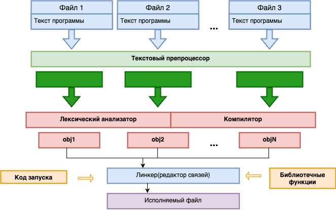

# 1.2 Этапы трансляции программы в машинный код. Стандарты

На предыдущем уроке был продемонстрирован принцип обработки команд процессором, когда в памяти содержалась последовательность чисел:

```
B8 22 11 00 FF 01 CA 31 F6 53 8B 5C 24 04 8D 34 48 39 C3 72 EB C3
```

и подавалась в виде исполняемых инструкций на центральный процессор.

Последовательность закодированных команд в виде целых чисел называется **машинным кодом**, только такой код "понимает" центральный процессор компьютера. 
Человеку создавать программы на таком уровне было бы очень непросто. Поэтому для облегчения работы программиста было предложено все эти числовые команды представлять в символьном виде, а именно в виде **мнемоник** языка **Ассемблер**. Например, представленная числовая последовательность на уровне **мнемоник ассемблера**, предложенная компанией AT&T, выглядит следующим образом:

| Метка   |             Мнемоника          |   Машинный код   |
|---------|--------------------------------|------------------|
|foo:     | `movl $0xFF001122, %eax`       | `B8 22 11 00 FF` |
|         | `addl %ecx, %edx`              | `01 CA`          |
|         | `xorl %esi, %esi`              | `31 F6`          |
|         | `pushl %ebx`                   | `53`             |
|         | `movl 4(%esp), %ebx`           | `8B 5C 24 04`    |
|         | `leal (%eax, %ecx, 2), %esi`   | `8D 34 48`       | 
|         | `cmpl %eax, %ebx`              | `39 C3`          |
|         | `jnae foo`                     | `72 EB`          |
|         | `Retl`                         | `C3`             |


Язык ассемблер дает заметное удобство при написании программ. Теперь программисту достаточно запомнить общие команды, вроде `movl` (переместить из памяти или регистра информацию в память или регистр); `addl` (сложить содержимое регистров или памяти); `xorl` (побитовая операция XOR) и т.д. Запоминать числовое (кодовое) выражение команд уже не нужно. Достаточно написать программу на уровне **мнемоник**, а затем с помощью **компилятора** языка Ассемблер перевести ее в числовой вид (машинные коды) понятный центральному процессору компьютера. 

Однако существенный недостаток языка Ассемблер заключается в его не универсальности, так как система команд (мнемоник) языка Ассемблер может несколько меняться при переходе от одной архитектуры процессора к другой, так как у каждого типа процессоров может быть собственный набор команд, своя разрядность, свои особенности работы. Поэтому перенос программы с одного компьютера на другой может иметь ряд трудностей.

Для преодоления этих и некоторых других недостатков стали создавать языки более высокого уровня абстракции, к примеру язык В который в последствии был вытеснен языком Си который был создан Деннисом Ритчи для переноса ОС компьютера PDP-7 на PDP-11.

### Этапы перевода (трансляции) текстов программы в исполняемый код.

Все что требуется от программиста - это создать один или несколько файлов с тестами программы, которая решает поставленные задачи. Каждый такой независимый файл с набором программ называется **модулем**. В контексте языка С все эти текстовые варианты программ переводятся (транслируются) на уровень машинных кодов. Как это происходит? Сначала каждый модуль независимо пропускается через текстовый препроцессор. Его задача в программе найти все директивы (указания) для этого препроцессора и выполнить их.

<p align="center">
    <kbd>
        
    </kbd>
</p>

В результате, исходный текст программы немного меняется. После этого преобразованные тексты передаются в компилятор (также независимо друг от друга), которые вначале проходят через лексический анализ программы. На этом этапе выявляются возможные синтаксические ошибки. Если ошибок не обнаружено, то далее программа переводится непосредственно в машинные коды. На выходе получаются **объектные файлы модулей**. Но в этих файлах **отсутствуют связи с другими модулями, реализации библиотечных функций, код запуска всей программы**. Все это делает на последнем этапе **Линкер** (редактор связей). Он связывает все объектные файлы модулей в единый исполняемый файл, добавляет в него необходимые реализации библиотечных функций и код запуска для текущей операционной системы. На выходе получается окончательный результат в виде **исполняемого файла**.

* Первое что стоит отметить в вопросе почему процесс поставлен так а иначе это независимая компиляция каждого модуля позволяет сократить время перевода большого проекта в машинный код, состоящего из десятков а то и сотен текстовых файлов. Во время первой компиляции будут скомпилированны все файлы и сформировать объектные файлы каждого модуля. Но в последующих изменениях программы в отдельных модулях, достаточно будет перекомпилировать только их, а потом собрать проект с помощью линкера, используя раннее созданные объектные файлы других не измененных модулей. Такой подход экономит время при изменении и отладке проекта. 

* Второе. Линкер добавляет в итоговые исполняемые файлы только те реализации библиотечных функций, которые используются в проекте, без лишних зависимостей. 

* Третье. Кроссплатформенность - использование компиляторов для разных архитектур процессоров и разных ОС позволяет относительно просто и быстро переносить ранее написанную программу с одной ОС на другую. Или с одной архитектуры процессора на другую.

Также стоит коротко упомянуть о стандартах принятых программистами для программистов, для того чтобы унифицировать процессы написания языка, самыми первым считается реализация стандарта 1989 года названная С89 и последующая ее модификация С99. На данный момент совершенствование стандарта не прекращается, однако базовы концепции остаются неизменными начиная с С99.