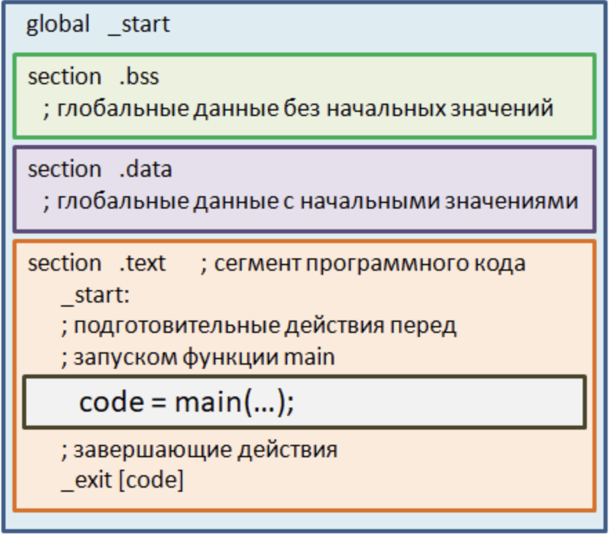

# 1.4 Структура и понимание работы программы "Hello, World!"

Пришло время познакомиться со структурой простой, но типовой программы. 

По традиции это будет конечно же всеми известный `Hello, World!` на экране.

```
/* Моя первая программа */
#include <stdio.h>
 
int main(void)
{
    printf("Hello, World\n");
    return 0;
}
```

**Необходимо отметить что текст программы пишется программистами для себя же или других программистов**, необходимо писать простой и понятный текст, не создавая искуственных усложнений. Думать о себе и других, чтобы передавая свой опыт, знания и наработки - другой человек смог без труда понять код программы.

Теперь разберем `Hello, World` построчно! 

* Первая строка является комментарием и данная функция реализована начиная со стандарта С89, в этом стандарте, комментарии отмечались только посредством комбинации символов `/*` и `*/` соответственно здесь отсутствует вложенность, мы не можем указать вот так `/* текст комментария /* вложенный текст комментария /* /*` это будет считаться отдельными блоками. Мы можем записать в таком виде все в одну строку или в несколько не имеет значения:

```
/* Это
многострочный
комментарий
*/
```

```
/* Это однострочный комментарий */
```

**Текст который начинается с** `/*` **и заканчивается** `*/` **не интерпретируется компилятором, соответственно не переводится в машинный код.**

Начиная со стандарта С99 появился формат однострочных комментариев, обозначаемых символами `//`. Пример:

```
// Моя первая программа
```

чаще всего однострочные комментарии используются для разъяснения отдельных операторов программы, например:

```
printf("Hello, World\n");   // вывод строки на экран
```

* Следующая строчка программы - это, так называемая, **директива препроцессора** на данный момент отметим что все директивы начинаются с символа шарп `#` и следом идет ее имя. В частности, директива `#include` выполняет включение содержимого заголовочного файла `stdio.h` в то место, где записана эта директива. Так сделано потому что изначально база языка С весьма ограничена и не имеет даже функции ввода/вывода. Поэтому для вывода информации на экран нам необходимо воспользоваться библиотечной функцией `printf()`, которая записана ниже в программе. Так вот, в текстовом файле `stdio.h` в частности прописано объявление функции `printf()`. Тут нужно обратить внимание что происходит объявление функции **а не ее реализация.** Компилятор языка С так устроен, что для формирования объектного файла текущего модуля - ему требуется только объявление функции, а конкретная реализация добавится на этапе линковки кода, то есть **редактором связей.** Эта реализация будет взята из библиотечного откомпилируемого модуля поставляемого вместе с компилятором языка С. Поэтому, все что нужно сделать линковщику - это найти фрагмент машинного кода для функции `printf()` и добавить в исполняемый файл.  Вот для этого и нужна в программе директива `#include` с подключением файла `stdio.h`, имя которого является сокращением от английских слов:

<p align="center">standard input ouput</p>

(cтандартный ввод/вывод). А расширение h - это первая буква слова header (заголовок). Получается заголовочный файл стандартного ввода/вывода.

* В следующей строчки программы идет объявление функции `main`. Забегая вперед следует отметить что **функции** - это активные элементы программы, которые выполняют заключенные в них операторы (инструкции). Вся программа написанная на языке С это по сути набор разных функций и их вызовом в запрограммированном порядке. Так вот первая функция, с которой начинается выполнение программы, должна называтся `main`. Так решил автор языка Деннис Ритчи. Все компиляторы языка С формируют машинный код так, что после загрузки программы в память компьютера, ОС передает управление сначала, секции кода как правило с переходом по метке `_start`. Там выполняются некоторые подготовительные действия, а затем вызывается функция `main()`. И это всегда так, без функции `main()` программа сразу же завершится с ошибкой 

<p align="center">
    <kbd>
        
    </kbd>
</p>

**В программе на С обязательно должна присутствовать функция main, которой передается управление после запуска программы и выполнения некоторых подготовительных действий** как показано в таблице сверху. 

Далее перед именем этой функции стоит ключевое слово `int` от англ `integer` - целое число, это означает целочисленный тип данных и то что функция `main()` возвращает целочисленное значение. После имени `main` должны идти круглые скобки и в них прописаны параметры функции. Так как в нашем примере функция `main()` не имеет параметров, то в круглых скобках указано ключевое слово `void` что дослово означает пустой. Далее, в фигурных операторных скобках прописываются операторы, которые будут последовательно выполняться(сверху-вниз) при вызове функции `main()`. В частности в представленной программе `Hello, World!`, сначала будет вызвана библиотечная функция `printf()` для вывода указаной строки в консоль, затем сработает оператор:

```
return 0;
```

Забегая вперед `return` выполняет два действия. Первое, он завершает вызов текущей функции `main()`. И второе, в нем указывается значение, которое будет возвращаться этой функцией. Почему именно 0? Дело в том что в последствии это значение будет передано ОС через системный вызов `_exit`. Именно этот системный вызов и завершает программу а не функция `main()`. Значение 0 говорит о том что программа успешно выполнила свою функцию и завершилась. Все другие значения отличные от нуля будут означать ошибки выполнения программы. К примеру мы что-то хотим записать в файл но ОС не позволяет открыть нам указанный файл на запись. Тогда программа может выдать сообщение с кодом об ошибке отличным от нуля. Хотя в современной практике так не поступают и просто выводят сообщение об ошибке с кодом 0.

Пару слов о функции `printf()`. Название функции - это сокращение от английских слов:

<p align="center">print formatted (форматированный вывод)</p>

Соответственно, эта функция способна выводить данные в виде форматированной строки. Строки в С обязательно должны быть заключены в **двойные** кавычки и никакие другие. 

Далее обратим внимание на символ `\n` в конце строки. Так прописываются спецсимволы, ставится слэш и затем символ или код символа. Символ `\n` означает перевод курсора на новую строку. То есть если бы мы следом еще раз вызвали функцию `printf()` и напечатали какую-либо информацию, она бы отображалась на следующей строке. 