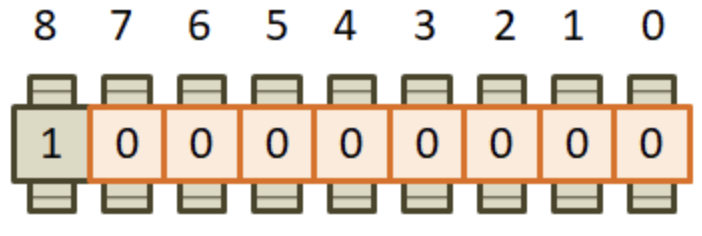

# 1.5 Двоичная, шестнадцатеричная и восьмеричная системы счисления

Прежде чем продолжать погружение в язык С, необходимо разобраться как в вычислительной технике происходит хранение целых чисел. А начнем с привычной для нас системы счисления - десятичной.

Любое число в десятичной системе счисления можно разложить на единицы, десятки, сотни и т.д:

<p align="center">7843 = 7 * 10^3 + 8 * 10^2 + 4 * 10^1 + 3 * 10^0</p>

Возрастание степени числа 10 идет справа-налево, а не слево-направо, как мы привыкли писать. Дело в том что форма записи арабских чисел, принятая большинством человечества, пришла к нам с востока. А на востоке все пишут именно справа налево. Поэтому мы видим справа единицы а затем все более и более значимые цифры при движении влево.

Приведеная система записи числа называется десятичной, так как здесь каждый разряд числе в 10 раз больше предыдущего. Сами же разряды обозначаются арабскими цифрами:

<p align="center">0 1 2 3 4 5 6 7 8 9</p>

Цифры это всего лишь обозначения (изображение) чисел. А вот числа это уже характеристика количества чего-либо. Например цифра 2 - это обозначение числа 2. А число 2 это к примеру два камушка, две чашки и тд. Мы понимаем у себя в голове сколько это два камушка. То же число два можно было бы обозначить например римской цифрой ||. Именно сама суть числа от этого не меняется. Оно по прежнему характеризует два количества. **Поэтому само число - это нечто общее и объективное, а цифры это всего лишь изображение чисел.**

### Двоичная система счисления

Теперь перейдем на уровень бит, из которых состоят ячейки памяти:

<p align="center">
    <kbd>
        
    </kbd>
</p>

Будем полагать, что каждая ячейка состоит из восьми бит и образует один байт информации. Именно в таком виде представлена вся информация в вычислительной технике. Здесь каждый бит как уже было сказано ранее, имеет два состояния `0` - это бит выключен и `1` - это бит включен. То есть общее количество чисел равно двум.

<p align="center">0 1</p>

Каким образом используя всего две цифры можно описывать множество различных чисел? Для ответа на этот вопрос, представим, что набор из восьми бит организован как счетчик, например электроэнергии, воды или газа. То есть там стоят шестеренки и они отсчитывают количество чего-либо:

<p align="center">
    <kbd>
        
    </kbd>
</p>

Пусть изначально все биты равны нулю. Так мы будем кодировать число 0:

<p align="center">0 0 0 0 0 0 0 0 = 0</p>

**Внимание!** затем самая **правая** шестеренка прокручивается и в младшем бите появляется цифра 1. Это следующая комбинация. Запишем ее **десятичным** числом 1:

<p align="center">0 0 0 0 0 0 0 1 = 1</p>

Далее, шестеренка под номером 0 снова прокручивается. По идеи как мы привыкли, здесь должна быть цифра 2 после цифры 1, но у нас всего два обозначения это 0 и 1. Значит после 1 снова увидем 0, но зато **следующая шестеренка** прокрутится и на ней мы увидим значение 1:

<p align="center">0 0 0 0 0 0 1 0 = 2</p>

То есть все работает как обычных счетчиках, только в нашем распоряжении не десять цифр а всего две. Продолжая аналогичным путем получаем послежовательности:

<p align="center">0 0 0 0 0 0 1 1 = 3</p>
<p align="center">0 0 0 0 0 1 0 0 = 4</p>
<p align="center">0 0 0 0 0 1 0 1 = 5</p>
<p align="center">0 0 0 0 0 1 1 0 = 6</p>
<p align="center">0 0 0 0 0 1 1 1 = 7</p>
<p align="center">...</p>
<p align="center">1 1 1 1 1 1 1 1 = 255</p>

Всего 256 вариантов, от 0 до 255. То есть в восьми битах можно закодировать любое целое неотрицательное число в диапазоне [0;255]. А представление числе в последовательности нулей и единиц получила название **двоичной формы** записи числа. Что соответствует **двоичной системе счисления.**

Показанный алгоритм формирования двоичных комбинаций и их нумерация десятичными числами от 0 до 255 имеет достаточно простое математическое выражение. Предположим, что перед нами записано некоторое число в двоичной форме:

<p align="center">
    <kbd>
        
    </kbd>
</p>

Спрашивается, чему будет равно его десятичное представление? Все очень просто. Так как мы имеем двоичную систему счисления, то каждый разряд числа - это два в соответствующей степени, а именно:

<p align="center">1 * 2^4 + 1 * 2^3 + 0 * 2^2 + 0 * 2^1 + 1 * 2^0 = 25</p>

Или так. Если все биты числа равны 1, то получаем десятичное число:

<p align="center">1 * 2^7 + 1 * 2^6 + 1 * 2^5 + 1 * 2^4 + 1 * 2^3 + 1 * 2^2 + 1 * 2^1 + 1 * 2^0 = 255</p>

А что будет если мы захотим занести в эти восемь бит следующее число:

<p align="center">256 = 255 + 1</p>

Это эквивалентно прокручиванию самой правой шестеренки на одну позицию и тогда согласно нашему алгоритму все ячейки должны обнулиться, а следующий старший разряд установиться в единицу:

<p align="center">
    <kbd>
        
    </kbd>
</p>

Но у нас всего 8 бит а не 9. Поэтому бит со значением 1 просто пропадает, а в оставшихся 8 битах остаются нули. Следовательно при попытке записать число 256 в один байт, мы получим такое явление как **переполнение** и, как результат значение 0. И, наоборот, если из нуля вычесть один, то получим значение 255

<p align="center">0 - 1 = 255</p>

**Все эти эффекты переполнения следует учитывать при работе с целыми числами.**

### Представление отрицательных чисел

Подход представления отрицательных чисел очень простой и вытекает из только что установленного факта: если из нуля вычесть 1 один, то получим 255. Но ничто нам не мешает вместо 255 кодировать значение -1:

<p align="center">0 - 1 = -1</p>

Соответственно если крайнюю правую шестеренку провернуть назад еще один раз, то мы получим уже значение -2:

<p align="center">
    <kbd>
        
    </kbd>
</p>

Поворачивая еще раз назад, будем получать следующие отрицательные числа -3, -4 и тд:

<p align="center">1 1 1 1 1 1 1 1 = -1</p>
<p align="center">1 1 1 1 1 1 1 0 = -2</p>
<p align="center">1 1 1 1 1 1 0 1 = -3</p>
<p align="center">1 1 1 1 1 1 0 0 = -4</p>
<p align="center">...</p>

На каком наименьшем отрицательном следует остановится? В практике программирования поступают следующим образом. Самый старший бит числа (в данном случае 8-й бит) отводят под знак. **Если он равен 1 - число отрицательное**, **если он равен 0 - число положительное**. Следовательно по нашей схеме формирования отрицательных чисел мы дойдем до:

<p align="center">1 0 0 0 0 0 0 0 = -128</p>

Соответственно максимально положительное число равно:

<p align="center">0 1 1 1 1 1 1 1 = 127</p>

Отсюда получаем диапазон представления отрицательных и положительных чисел в одном байте от -128 до 127.

Это совсем небольшой диапазон значений и для большинства практических задач этого становится недостаточно. Как в такой ситуации быть? Все на самом деле очень просто. Можно под хранение чисел отвести не один а два идущих подряд байта.

<p align="center">
    <kbd>
        
    </kbd>
</p>

Тогда диапазон целых числе составит от 0 до 2^16 - 1 = 65535, а для чисел со знаком [-32768;32767]

```
от: 1000000000000000 = -32768
до: 0111111111111111 = 32767
```

Если и этого диапазона значений будет недостаточно, то можно взять 4 байта а затем 8 байтов. Обычно 8 байт для решения задач программирования бывает вполне достаточно. 

### Шестнадцатиричная система 

Вернемся к одному байту состоящему из восьми бит:

<p align="center">
    <kbd>
        
    </kbd>
</p>

Можно заметить что каждая из его половин состоит из четырех бит. И мы легко можем рассчитать число возможных вариантов, которые кодируются разными этими четырьмя битами:

<p align="center">2^4 = 16</p>

Их всего шестнадцать. А раз так, то почему бы каждую половинку не представлять одной цифрой. Только это будет цифра не десятичного а шестнадцатеричного числа, то есть, числа записанно в шестнадцатеричной системе счисления. Давайте это сделаем! Первое что нам понадобится это 16 различных цифр. Первые десять логично взять из знакомой нам десятичной системы счисления, а именно в виде следующих арабских значений:

<p align="center">0 1 2 3 4 5 6 7 8 9</p>

Не хватает еще шести. Недолго думая, решили в их качестве воспользоваться первыми шестью буквами латинского алфавита.

<p align="center">A, B, C, D, E, F</p>

В результате цифра А обозначает число 10, В число 11 и так далее до F - 15. С помощью этих шестнадцати цифр мы имеем возможность описать любую комбинацию из четырех бит:

|           |           |           |           |
|-----------|-----------|-----------|-----------|
|0 0 0 0 = 0|0 1 0 0 = 4|1 0 0 0 = 8|1 1 0 0 = C|
|0 0 0 1 = 1|0 1 0 1 = 5|1 0 0 1 = 9|1 1 0 1 = D|
|0 0 1 0 = 2|0 1 1 0 = 6|1 0 1 0 = A|1 1 1 0 = E|
|0 0 1 1 = 3|0 1 1 1 = 7|1 0 1 1 = B|1 1 1 1 = F|


К примеру вот представление числа 1А на уровне байта:

<p align="center">1A = 0 0 0 1 1 0 1 0</p>

Мы легко можем переходить из двоичной записи в шестнадцатеричную:

<p align="center">1 0 1 1 0 0 1 = B1</p>

И наоборот из шестнадцатеричной в двоичную.

При необходимости любове шестнадцатеричное число можно перевести в десятичный вид, пусть это будет число 5FC

Представим его вначале как сумму степеней 16-ти:

<p align="center">5FC = 5 * 16^2 + F * 16^1 + C * 16^0</p>

А затем, вместо F подставим эквивалент из десятичной системы 15, а вместо С значение 12, получим выражение 

<p align="center">5FC = 5 * 16^2 + 15 * 16^1 + 12 * 16^0 = 1532</p>

### Восьмеричная система счисления

В практике программирования также встречается восьмеричная система счисления, на раннем этапе развития вычислительной техники она была распространнена. Однако сейчас практически полностью вытеснена шестнадцатеричной. Тем не менее язык С позволяет записывать числа в восьмеричной системе. Кроме того ОС UNIX использует восьмеричную систему для настройки прав доступа и некоторых других задач, где требуется представление группы из трех бит.

В целом она подобна десятичной и шестнадцатеричной записи. Цифрами восьмеричной системы выступают значения:

<p align="center">0 1 2 3 4 5 6 7</p>

А разряды расписываются через произведение восьмерок с разными степенями. Например число:

<p align="center">437 = 4 * 8^2 + 3 * 8^1 + 7 * 8^0 = 287</p>

В целом это такая же система как и другие, только основание у нее восемь.

Конечно, как бы мы не записывали числа в программе языка С, какую бы форму записи не использовали, на уровне машинных кодов, для процессора, они все представляются в виде нулей и единиц, то есть в битовом виде - двоичном формате. Любой другой вид чисел служит лишь для нашего удобства и не более того.

[ссылка на оригинальную прозу](https://proproprogs.ru/c_base/c_dvoichnaya-shestnadcaterichnaya-i-vosmerichnaya-sistemy-schisleniya)