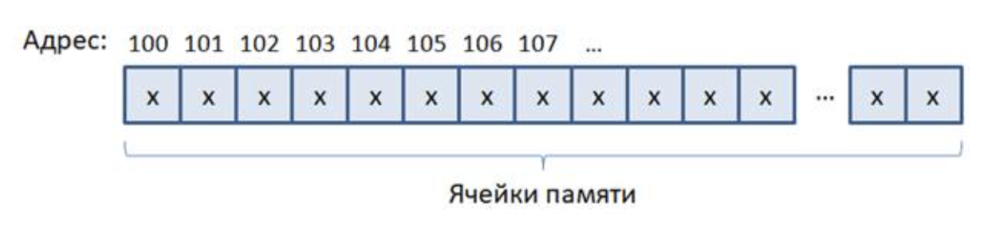

# 2.1 Переменные и их базовые типы. Модификаторы unsigned и signed

Cпособы хранения данных на уровне программы представлены в двух видах:

* переменные - изменяемые значения
* константы и литералы - неизменяемые значения

Данные в памяти компьютера хранятся в виде неделимых ячеек в один байт, которые образуют непрерывную последовательность определенной длины:

<p align="center">
    <kbd>
        
    </kbd>
</p>

В современных компьютерах, каждой программе отводится своя, независимая рабочая область памяти. И адреса ячеек уже становятся не физическими (реальными) а логическими (виртуальными) - теми, которые определит для программы ОС. Это сделано для повышения надежности работы сразу нескольких программ в один и тот же момент времени. Но нам, как программистам важно лишь только что каждая ячейка в один байт имеет свой адрес(физический или логический не играет особой роли.) и все они следуют друг за другом в пронумерованном порядке. Причем адреса всегда увеличиваются на единицу при переходе к следующей ячейке памяти. 

В самом простом случае, мы можем поместить в ячейку памяти запись числа в диапазоне [0;255] этот диапазон формируется из того что в одной ячейке памяти может находится 8 бит(или же один байт) информации а в свою очередь бит имеет всего два состояния 0 и 1, соответственно 2^8 = 255. Значит в один байт можно произвольно записывать числа в диапазоне от 0 до 255 включительно. Для того чтобы в программе на языке С работать с отдельной ячейкой памяти следует пользоваться такой конструкцией:

```
char byte_memory;
```

Здесь `char` - это тип переменной а `byte_memory` ее имя. Именно так следует объявлять переменные в языке С. Сначала указывается тип данных а затем имя переменной. На синтаксическом уровне это выглядит следующим образом:


<p align="center"><тип переменной> <имя переменной>;</p>

Стоит обратить внимание на точку запятой в конце переменной, ведь они являются неотъемлемой частью оператора, а не разделителя между ними(операторами) как иногда полагают. В данном случае точка с запятой указывает компилятору где заканчивается объявление переменной и превращает запись в полноценный, законченный оператор. Далее мы увидим как символ точка с запятой входит в состав синтаксиса оператора цикла for и она там играет особую роль. На данный момент следует запомнить что запись оператора объявления переменной (или нескольких переменных) должна завершаться точкой с запятой. 

Вернемся к типу `char` он описывает хранилище данных размером в один байт и позволяет хранить 256 вариаций целых чисел. А имя переменной - это по сути название хранилища, где расположено некоторое целое число.

<p align="center">
    <kbd>
        
    </kbd>
</p>

На рисунке переменная `byte_memory` условно находится в 103 ячейке памяти. В действительности, расположение переменных в памяти определяет **менеджер памяти ОС.** Когда в программе объявляется очередная переменная, то ОС располагает ее в найденно свободной последовательности ячеек. И, как вы понимаете, в общем случае, адрес хранения переменной может быть самым разным. 

На уровне программы для нас это не имеет никакого значения. Мы всегда легко можем обратиться к хранилищу данных по имени переменной, прочитать или записать туда нужные значения. Делается это посредством операции присваивания, следующим образом:

```
byte_memory = 100;
char a;
a = byte_memory;
```

Здесь стоит отметить что в левый операнд заносится записанное значение в правом операнде. То есть, при выполнении первой строчки, в переменную `byte_memory` будет занесено целое число 100. В нашем случае это автоматически означает что ячейка памяти с номером 103 будет содержать число 100. В этом и есть смысл переменных, они могут менять свои значения в процессе выполнения программы.

В двух следующих строчках происходит объявление еще одной байтовой переменной с именем `а` и **копированием** туда значения из переменной `byte_memory`. В языке С переменные - это непосредственно хранилища данных, поэтому в момент присваивания происходит копирование информации из одного хранилища в другое. То есть переменные `a` и `byte_memory` совершенно независимы между собой.

Дополнительно стоит указать некоторые терминологические моменты:

<p align="center">
    <kbd>
        
    </kbd>
</p>

Тип `char` относится к одному из ключевых, то есть зарезервированных слов языка С. В программе оно воспринимается компилятором исключительно как байтовый тип переменной и не может быть использовано в каком-либо другом качестве, например как имя переменной.

Далее имя переменной еще называют идентификатором, то есть имя как бы идентифицирует область памяти, которую представляет. Идентификатором также являются имена функций и некоторые конструкцие языка С. 

Применительно к имени переменной, в соответствии со стандартом С99, ее максимальная длина внутри модуля составляет 63 символа. Можно задавать имена и длиннее 63 символов, но компилятор будет учитвыать только первые 63 символа. Если переменная используется за пределами модуля, где она объявлена то ее максимальная длина составляет 31 символ. Это следует учитывать, хотя размер переменных более чем достаточен, чтобы не переходить указанные границы.

Теперь стоит внимательно ознакомиться с тем как же следует именовать переменные. Так как они представляют собой хранилища, то они должны быть существительными. Например:

<p align="center">data, name, total, count, size, fl_view и т.п</p>

Cледует иметь в виду, что язык С различает большие и маленькие буквы в названиях переменных и любых идентификаторов. Поэтому переменные:

<p align="center">Comp, comp, COMP, cOmp</p>

-- являются разными. В их именах можно использовать символы только латинского алфавита, цифры и символ подчеркивания:

<p align="center">a-z, A-Z, 0-9, _</p>

Причем в качестве первого символа может идти или буква или символ подчеркивания. Цифра может появится только начиная со второго символа в названии переменной.

Вот примеры правильных и неправильных имен:


|Правильные имена           |Неправильные имена           |
|---------------------------|-----------------------------|
|total_digits               |1_house                      |
|a                          |don’t                        |
|b                          |K&R                          |
|fl_mine                    |100                          |
|_arg                       |find@10                      |
|__Apple1                   |si#                          |
|Count_Views100             |array[]                      |


Принято имена переменных записывать маленькими буквами латинского алфавита без первого символа подчеркивания. Например, так:

<p align="center">swift, book_si, text_array, counter и т.д.</p>

**Имена переменных должны быть уникальными в пределах одной области видимости.**

### Базовые типы данных

Типы данных языка С представлены в таблице:


| <p align="center">Тип данных</p> | <p align="center">Для 16-битных</p> | <p align="center">Для 32-битных</p> | <p align="center">Для 64-битных</p> | <p align="center"> Описание </p> | <p align="center"> Диапазон </p> |
|----------------------------------|-------------------------------------|-------------------------------------|---------------------------|--------------------------|--|
|char                              | <p align="center"> 1 </p>           | <p align="center"> 1 </p>           | <p align="center"> 1 </p> |Символьный и целочисленный|[0;255] или [-128;127]|
|short [int]                       | <p align="center"> 2 </p>           | <p align="center"> 2 </p>           | <p align="center"> 2 </p> |Целочисленный|[-32768;32767]|
|int                               | <p align="center"> 2 </p>           | <p align="center"> 4 </p>           | <p align="center"> 4 </p> |Целочисленный|[-32768;32767] или [-2147483648;2147483648]|
|long [int]                        | <p align="center"> 4 </p>           | <p align="center"> 4 </p>           | <p align="center"> 8 </p> |Целочисленный| ... |
|<span style="color:orange">long long [int]</span>|<span style="color:orange"><p align="center"> 8 </p></span>|<span style="color:orange"><p align="center"> 8 </p></span>|<span style="color:orange"><p align="center"> 8 </p></span>|<span style="color:orange"> Целочисленный </span>|<span style="color:orange">...</span>|
|float                             | <p align="center"> 4 </p>           | <p align="center"> 4 </p>           | <p align="center"> 4 </p> |Вещественный | ... |
|double                            | <p align="center"> 8 </p>           | <p align="center"> 8 </p>           | <p align="center"> 8 </p> |Вещественный | ... |
|long double                       | <p align="center"> 10 </p>          | <p align="center"> 10 </p>          | <p align="center"> 10 </p> |Вещественный | ... |

Тип `long long` помечен оранжевым так как поддерживается не всеми компиляторами. В стандарте С99 были добавлены некоторые другие типы, но они не часто используются на практике. 

Первое что бросается в глаза при взгляде на эту таблицу, это плавающий размер типов в зависимости от разрядности прцоессора и ОС. Они приведены лишь как некий ориентир. Стандарты языка С никак не оговаривают конкретные размеры типов данных. А значит компиляторы могут использовать такие, которые в них заложит разработчик. Конечно большинство компиляторов согласуют размеры согласно приведенной выше таблице. Но гарантии никакой нет. И конечно же возникает вопрос, почему бы эти размеры строго не определить и договориться использовать вполне определенные значения? На это есть веское основание, язык С был разработан чтобы заменить язык Ассемблер и программы на С должны наилучшим образом переводится в машинный код. А машинный код жестко привязан к архитектуре компьютера: разрядности регистров процессора, шины и ячеек памяти. К примеру тип `char` создан чтобы работать с отдельными ячейками памяти. Если в компьютере они составляют 8 бит, то и компилятор будет описывать тип `char` восьмью битами. Если представить технику с ячейками в 12 бит то логично тип `char` сделать 12-битным. Вот почему размеры типов жестко не регламентируются спецификациями языка С. И так со всеми остальными. Например `int` это основной среди целочисленных потому что вплоть до появления 64-битных процессоров `int` составлял 16 бит (2 байта), при 32-битных - 32 бита (4 байта). А вот при появлении 64-битных остался 32-битным. Так как большинство программ к тому моменту уже было написано под 32-битную архитектуру процессора. А компиляторы стараются создавать так чтобы программы на С были переносимы на другие платформы.

Но одно можно с уверенностью сказать. Относительно распределения размеров следующее:

<p align="center">char <= short <= int <= long <= long long</p>
<p align="center">float <= double <= long double</p>

Примем как данность неопределенность размеров типов и будем ориентироваться на данные из таблицы. В ней мы видим еще такую запись:

<p align="center">short [int] или long [int] или long long [int]</p>

Значения в квадратных скобках означают что формально эти типы можно записывать как `int` в конце так и без него:

```
short int a;
short b;
long d;
long int m;
```

От добавления `int` тип данных не меняется, поэтому в современной практике написания программ на языке С ключевое слово `int` не указывается к этим типам данных а пишут просто:

```
short b;
long d;
```

Зачем тогда существует эта особенность? Видимо так исторически сложилось. Возможно создатель языка - Деннис Ритчи изначально задумывал один общий целочисленный тип `int` и два модификатора к ниму `short` и `long` чтобы иметь возможность определять более короткие или длинные по размеру памяти целочисленные переменные.

### Модификаторы signed и unsigned 

Когда мы в программе задаем переменную этого типа:

```
char fl_view;
```

то в зависимости от компилятора она может принимать целые числа в диапазоне [0;255] или целые числа в диапазоне [-128;127]. Стандартом никак это не оговорено. Эти диапазоны возникли от того что [0;255] это беззнаковое представление целых чисел в одном байте, а [-128;127] представление целых чисел со знаком. С помощью модификаторов unsigned и signed мы можем описать переменную как беззнаковую или знаковую:

* unsigned - беззнаковый тип;
* signed - знаковый(появился в стандарте ASNI C90).

Если при объявлении явно указать:

```
unsigned char fl_view;
```

то переменаня fl_view будет описывать целые числа в интервале [0;255]. Если указать:

```
signed char fl_view;
```

то переменная будет описывать целые числа в интервале [-128;127].

**Внимание! Все остальные целочисленые типы(short, int, long, long long) по умолчанию всегда идут как знаковые.** Поэтому определение вида: 

```
int arg;
```

создает переменную arg как целочисленную и знаковую. И так со всеми другими типами кроме `char`. Именно по этой причине появился модификатор `signed`, чтобы гарантированно объявлять переменную `signed` со знаком. У других типов бесмыссленно указывать модификатор `signed` - он идет по умолчанию, однако второй модификатор `unsigned` имеет смысл. Например:

```
unsigned short d;
```

Получаем целочисленную беззнаковую переменную `d`.

**К вещественным типам данных float и double применять модификаторы signed/unsigned нельзя! Потому что вещественные типы всегда знаковые**

### Рекомендации по выбору типа переменных

* Если требуется хранить отдельные символы и работать с отдельными ячейками памяти, то для этого существует `char`.
* Если предполагается оперировать целочисленными значениями, то изначально следует подумать об `int`. 
* Для описания вещественных чисел (чисел с плавающей точкой), следует изначально рассматривать `double`. И обращаться к типу `float` только если в программе предполагается создавать множество вещественных чисел(от 1000 и более).

[ссылка на оригинальную прозу](https://proproprogs.ru/c_base/c_peremennye-i-ih-bazovye-tipy-modifikatory-unsigned-i-signed)


