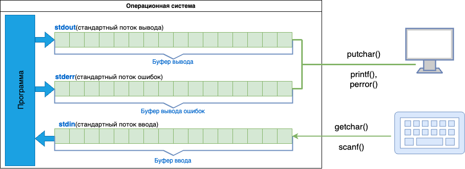

# 2.3 Потоки ввода/вывода. Функции putchar() и getchar()

Программы часто выводят результат своего выполнения на монитор, а считывают информацию с клавиатуры. Хотя это не обязательно так, но чаще всего мы имеем дело именно с монитором и клавиатурой. Так вот, на уровне операционной системы как правило имеется три стандартных потока ввода/вывода:

* `stdout` - стандартный поток вывода информации(как правильно, на монитор);
* `stderr` - стандартный поток вывода ошибок(как правило, на монитор);
* `stdin` - стандартный поток ввода(как правило, с клавиатуры);

<p align="center">
    <kbd>
        
    </kbd>
</p>


Все эти потоки можно настроить и на любые другие устройства. Например в некоторых случаях потоки ошибок `stderr` ассоциируются с самописцем(принтером), который сразу на бумаге выдает ошибки, произошедшие в процессе работы программы. А поток вывода `stdout` можно связать с файлом, куда будет выводиться информация. Аналогично и с потоком `stdin`, вместо клавиатуры может использоваться любое другое устройство, информация с которых в битовом представлении поступает в поток ввода. То есть клавиатура и монитор это всего лишь частные, но частые случаи. Благодаря использованию стандартных потоков ввода/вывода, программы способны универсальным образом работать с любыми устройствами, связанными с этими потоками. И это очень удобно.

На программном же уровне, все эти потоки организованы в виде неких буферов приема и передачи информации. То есть, данные поступают в буфер и только потом на устройства вывода либо в переменные программы. Это очень важный момент. Данные поступают в программу с клавиатуру не на прямую а через буфер и только потом в программу. То же самое и с выводом. Сначала данные поступают в буфер а только потом на устройства вывода или в файл.

### Функции для работы со стандартными потоками

Языкс С предоставляет набор библиотечных функций, для работы со стандартными потоками. Познакомимся с тем что наиболее чаще встречаются и используются:

* `putchar()` - вывод символа через поток `stdout`;
* `printf()` - форматный вывод строки через поток `stdout`;
* `perror()` - вывод ошибок в виде строки через поток `stderr`;
* `getchar()` - чтение одного байта (символа) из потока `stdin`;
* `scanf()` - форматный ввод данных из потока `stdin`.

Описания (прототипы) всех этих функций даны в заголовочном файле `stdio.h`. То есть для их использования в программе вначале должна быть прописана директива:

```
#include <stdio.h>
```

### Функция getchar()

Начнем обзор с функции `getchar()`. Она имеет следующее определение:

<p align="center"> int getchar(void); </p>

Целочисленный тип `int` перед функцией означает, что она возвращает целое число, а `void` в круглых скобках означает отсутствие каких-либо параметров. Поэтому мы можем вызвать ее в программе следующим образом:

```
#include <stdio.h>
 
int main(void)
{
    int value = getchar();
 
    return 0;
}
```

после запуска этой программы, будет ожидаться ввод значений в поток `stdin`. Так как он по умолчанию ассоциируется с клавиатурой, то нужно набрать один символ, любой, к примеру символ буквы `'s'` и нажать клавишу `Enter`.  После этого программа перейдет к шагу `return 0` и завершится.

Функция `getchar()` предназначена для чтения одного байта из входного потока `stdin`. Почему эта функция возвращает целое число типа `int`, а не данные типа `char`, который и описывает один байт памяти? Дело в том что стандартный поток ввода работает несколько более сложным способом, нежели просто выдача очередного байта из буфера. В частности, он дополнительно генерирует **некоторые служебные значения.** Например значение:

<p align="center"> EOF (End of File – конец файла) </p>

которое определено как `-1` в заголовочном файле `stdio.h`. То есть помимо байтового диапазона [0;255] целых чисел, функция `getchar()` дополнительно может вернуть значение вне этого диапазона, в частности `-1`.

Может показаться странным, что здесь говорится про константу `EOF`, когда речь идет о вводе данных с клавиатуры? Но, во-первых стандартный поток ввода `stdin` вполне можно связать с файлом и тогда данные будут читаться из него, а не с клавиатуры и при достижении конца файла будет сгенерировано значение `EOF`. Во-вторых при вводе с клавиатуры мы также можем симитировать достижение конца файла путем ввода специального символа комбинацией клавиш(для каждой ОС разного типа, существует своя комбинация).

Таким образом функции `getchar()` нужно возвращать целые значения, превыщающие байтовый диапазон [0;255]. Поэтому Деннис Ритчи(разработчик языка С) решил использовать тип `int`.

### Функция putchar()

Cледующая аналогичная функция `putchar()`, которая служит для вывода одного байта (символа) в выходной поток `stdout` и определена следующим образом:

<p align="center"> int putchar(int ch); </p>

Она также возвращает целое число типа `int` и в качестве аргумента принимает целое значение типа `int`. В действительности, тип `int` здесь использован для сопряжения (по типам данных) с функцией `getchar()`. Иначе бы можно было прописать тип `char`, так как функция `putchar()` в качестве аргумента принимает код символа в диапазоне [0;255]. Любое другое значение за пределами этого диапазона будет приводится к восьми битам и затем помещаться в входной поток `stdout`. Возвращает эта функция код символа, переданного в выходной поток:

```
#include <stdio.h>
 
int main(void)
{
    int value = getchar();
    int res = putchar(value);
    printf("\n%d\n", res);
 
    return 0;
}
```

При выполнении этой программы, нам необходимо будет ввести какой-либо символ с клавиатуры и затем, он продублируется вызовом функции `putchar()`. Возвращаемое значение (код введенного символа) будет выведено на экран с помощью функции `printf()`. 

На практике функцию `putchar()` используют исключительно для вывода информации в стандартный поток `stdout`. Поэтому возвращаемое значение просто игнорируют:

```
putchar(value);
```

То есть, если функция возвращает какое-либо значение нет необходимости учитывать это значение. В этом случае говорят **функция вызвана ради побочного эффекта.** .В языке С это обычная практика.

### Буферы приема/передачи стандартных потоков

При запуске программы буферы приема/передачи пустые, но по мере поступления или отправления информации они начинают наполнятся некими значениями и это может повлият на ход выполнения программы.

Запишем два подряд идущих вызова функции `getchar()` следующим образом:

```
#include <stdio.h>
 
int main(void)
{
    int value1 = getchar();
    int value2 = getchar();
 
    printf("%c %c\n", value1, value2);
 
    return 0;
}
```

После запуска программы введем с клавиатуры два символа `d` и `s`, в результате оба символа перемещаются во входной буфер, первый считывается при первом вызове функции `getchar()` а второй при втором вызове. Таким образом переменная `vaule1` приобретает значение `d` а переменная `value2` значение `s`. Программа больше не ждет от нас какой либо дополнительной информации и переходит в к функции `printf()`. После выполнения функции `printf()` значения `d` и `s` очищаются из буфера. Но в случае если бы мы ввели не два а три символа, то после чтения первых двух, третий так бы и остался во входном буфере до момента завершения программы. При завершении программы буферы автоматически очищаются.

[ссылка на оригинальную прозу](https://proproprogs.ru/c_base/c_standartnye-potoki-vvodavyvoda-funkcii-putchar-i-getchar)